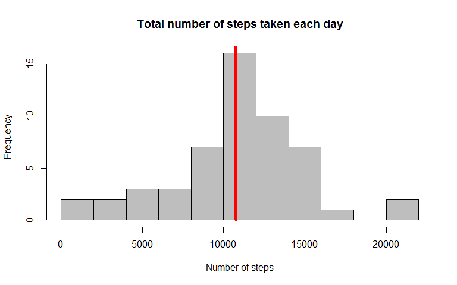
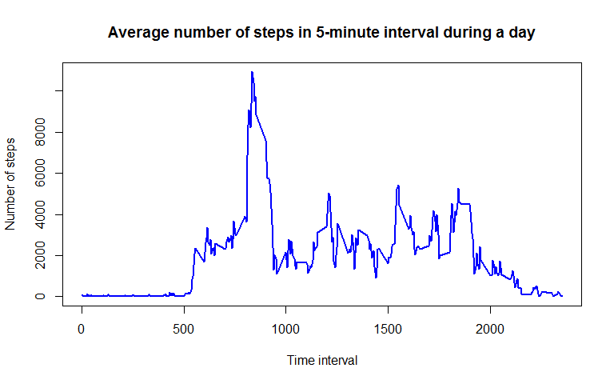
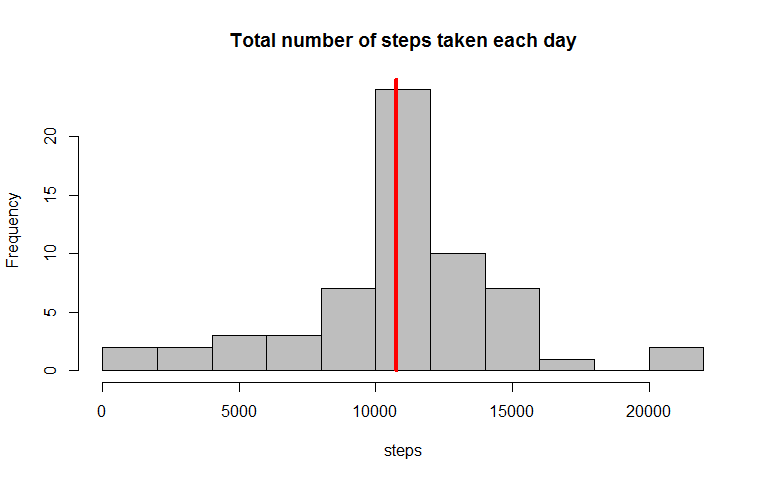
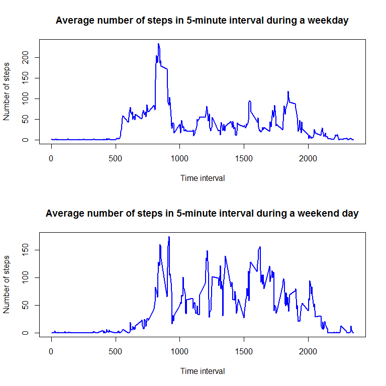

# Reproducible Research: Peer Assessment 1
Anastasia Thöns  
`r format(Sys.time(), '%d %B, %Y')`  

## Introduction

It is now possible to collect a large amount of data about personal movement using activity monitoring devices such as a Fitbit, Nike Fuelband, or Jawbone Up. These type of devices are part of the "quantified self" movement - a group of enthusiasts who take measurements about themselves regularly to improve their health, to find patterns in their behavior, or because they are tech geeks. But these data remain under-utilized both because the raw data are hard to obtain and there is a lack of statistical methods and software for processing and interpreting the data.

This assignment makes use of data from a personal activity monitoring device. This device collects data at 5 minute intervals through out the day. The data consists of two months of data from an anonymous individual collected during the months of October and November, 2012 and include the number of steps taken in 5 minute intervals each day.

## Loading and preprocessing the data

 The dataset is stored in a comma-separated-value (CSV) file and there are a total of 17,568 observations in this dataset.
 
 Dataset: Activity monitoring data [52K]


```r
if (!file.exists("data")) {
  dir.create("data")
  unzip("activity.zip", exdir = "./data")
}
path<-paste("./data/activity.csv", sep =",")
activity.data <- read.csv(path)
```

The variables included in this dataset are:

* **steps**: Number of steps taken in a 5-minute interval (missing values are coded as NA)
* **date**: The date on which the measurement was taken in YYYY-MM-DD format
* **interval**: Identifier for the 5-minute interval in which measurement was taken


```
##      steps                date          interval     
##  Min.   :  0.00   2012-10-01:  288   Min.   :   0.0  
##  1st Qu.:  0.00   2012-10-02:  288   1st Qu.: 588.8  
##  Median :  0.00   2012-10-03:  288   Median :1177.5  
##  Mean   : 37.38   2012-10-04:  288   Mean   :1177.5  
##  3rd Qu.: 12.00   2012-10-05:  288   3rd Qu.:1766.2  
##  Max.   :806.00   2012-10-06:  288   Max.   :2355.0  
##  NA's   :2304     (Other)   :15840
```

## What is mean total number of steps taken per day?

Find levels of factor `date` to identify the dates ans sum number of steps

```r
steps.day <- aggregate(steps ~ date, activity.data, sum)
```

Calculate and report the mean and median of the total number of steps taken per day

```r
mean.steps <- mean(steps.day$steps, na.rm = TRUE)
mean.steps
```

```
## [1] 10766.19
```

```r
median.steps <- median(steps.day$steps)
median.steps
```

```
## [1] 10765
```

<!-- -->

## What is the average daily activity pattern?

Make a time series plot (i.e. type = "l") of the 5-minute interval (x-axis) and the average number of steps taken, averaged across all days (y-axis)

```r
steps.daily <- aggregate(steps ~ interval, activity.data, sum)
```
<!-- -->

Which 5-minute interval, on average across all the days in the dataset, contains the maximum number of steps?

```r
steps.daily$interval[which.max(steps.daily$steps)]
```

```
## [1] 835
```
In average the most active time of the day is 8:35 am.

## Imputing missing values

Note that there are a number of days/intervals where there are missing values (coded as NA). The presence of missing days may introduce bias into some calculations or summaries of the data.

 1. Calculate and report the total number of missing values in the dataset (i.e. the total number of rows with NAs)

```r
sum(rowSums(is.na(activity.data))==1)
```

```
## [1] 2304
```

 2. Devise a strategy for filling in all of the missing values in the dataset. My choice was to take the mean for that 5-minute interval.

```r
steps.daily.mean <- aggregate(steps ~ interval, activity.data, mean)
ind.na = which(is.na(activity.data)==1)
```

 3. Create a new dataset that is equal to the original dataset but with the missing data filled in.


```r
activity.data.filled <- activity.data
for (i in 1 : length(ind.na)) {
  activity.data.filled[ind.na[i],1] <- steps.daily.mean[which(steps.daily.mean[,1]==activity.data.filled[ind.na[i],3]),2]
}
sum((is.na(activity.data.filled))==1)
```

```
## [1] 0
```
The later line is to verify that there are no `NA` values in the created data frame.

 4. Make a histogram of the total number of steps taken each day and Calculate and report the mean and median total number of steps taken per day. Do these values differ from the estimates from the first part of the assignment? What is the impact of imputing missing data on the estimates of the total daily number of steps?

```r
steps.day.filled <- aggregate(steps ~ date, activity.data.filled, sum)
mean.steps.filled <- mean(steps.day.filled$steps, na.rm = TRUE)
mean.steps.filled
```

```
## [1] 10766.19
```

```r
median.steps.filled <- median(steps.day.filled$steps)
median.steps.filled
```

```
## [1] 10766.19
```

<!-- -->

As expected, the method used to fill the missing data does not affect the average. However, as we can see from the histogram plots, the frequency distribution becomes more concentrated in the mean value, i.e. the bar containing the average value is higher then in the original data.

## Are there differences in activity patterns between weekdays and weekends?
I decided to use `strftime()` R function instead of the proposed `weekdays()` as with the option settings `%u` it gives a number for the weekdays, which is easier to handle for the following use.


```r
str(as.numeric(strftime(as.Date(activity.data[,2]),'%u')))
```

```
##  num [1:17568] 1 1 1 1 1 1 1 1 1 1 ...
```

 1. Create a new factor variable in the dataset with two levels - "weekday" and "weekend" indicating whether a given date is a weekday or weekend day.

```r
weekdays <- 1:length(activity.data[,1])
for (i in 1 : length(activity.data[,1])) {
  if (as.numeric(strftime(as.Date(activity.data[i,2]),'%u')) < 6) {
    weekdays[i] <- 0 
  } else {
    weekdays[i] <- 1 
  }
}
weekdays.f <- factor(weekdays, labels = c("weekday", "weekend"))
activity.data$weekdays <- weekdays.f
```
Of course, this is not an optimum implementation, as loops are always slower then any ready function. However, it works and is easy to understand.

 2. Make a panel plot containing a time series plot (i.e. type = "l") of the 5-minute interval (x-axis) and the average number of steps taken, averaged across all weekday days or weekend days (y-axis). See the README file in the GitHub repository to see an example of what this plot should look like using simulated data.

```r
ind.weekday <- which(weekdays.f == "weekday")
ind.weekend <- which(weekdays.f == "weekend")

steps.weekday.mean <- aggregate(steps ~ interval, activity.data[ind.weekday,], mean)
steps.weekend.mean <- aggregate(steps ~ interval, activity.data[ind.weekend,], mean)
```
<!-- -->

```r
mean(steps.weekday.mean$steps, na.rm = TRUE)
```

```
## [1] 35.33796
```

```r
mean(steps.weekend.mean$steps, na.rm = TRUE)
```

```
## [1] 43.07837
```

The two plots tell us that in average the activity on a weekend day is more spread during the daytime, when on a weekday the main activity is concentrated in the morning. In addition, on average the activity is generally higher on a weekend day.

**Note** For all graphical output basic graph was used.
